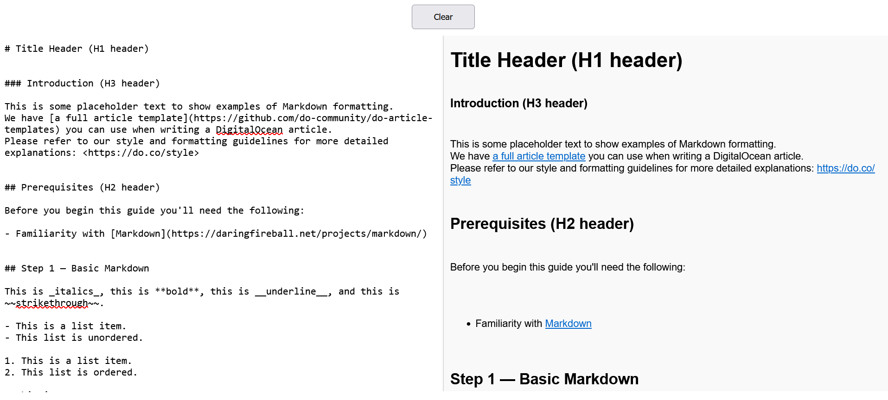

# About Markdown Previewer
## Introduction
This is a simple Markdown Previewer built using HTML, CSS, and JavaScript. It allows users to type Markdown syntax in a textarea and see the formatted preview in real-time without any backend processing.
## Features
- **Live Preview** - Updates in real-time as you type.
- **Supports Basic Markdown** :
1. Headings (# H1, ## H2, etc.)
2. Bold (**bold**) & Italics (*italic*)
3. Links ([title](http://example.com)).
4. Ordered & Unordered Lists (1. Item and - Item).
- **Code Highlighting** - Supports inline and block code using highlight.js.
- **Clear Button**: Clears the Markdown input and preview.
## User Guide
1. Open index.html in a web browser.
2. Type Markdown syntax in the textarea on the left.
3. View the formatted output in the preview section on the right.
4. Click the Clear button to reset the input.
## Here's how the app looks:
- Home Page

## Tech Stack
- HTML
- CSS
- JavaScript
- marked.js (for Markdown parsing)
- highlight.js (for syntax highlighting)
